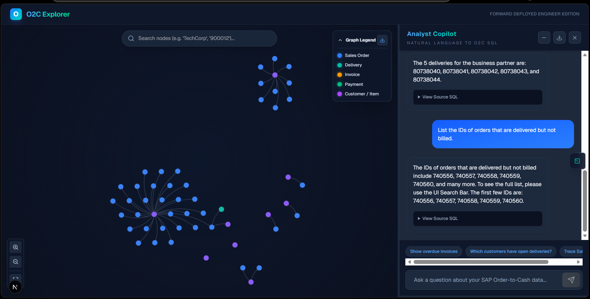
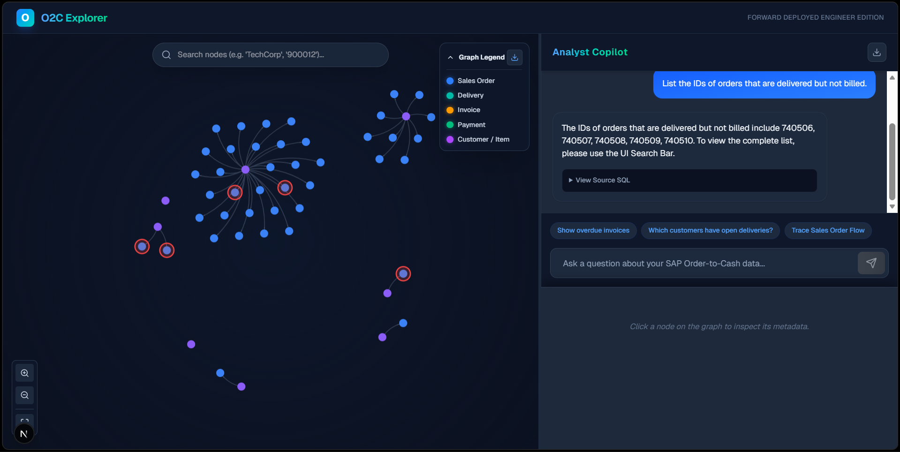
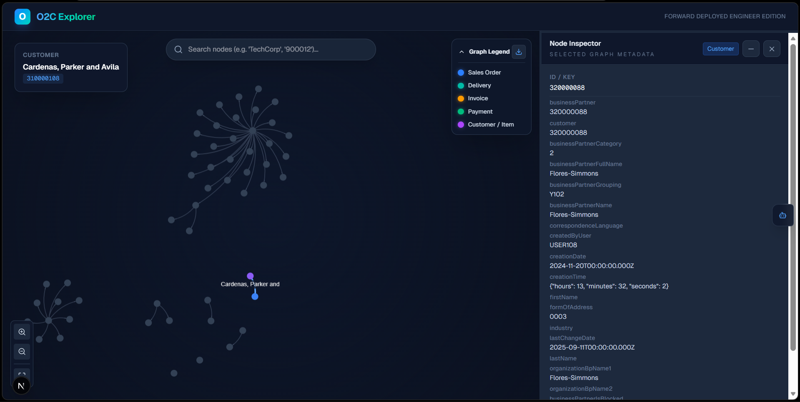

# SAP O2C Cognitive Graph Explorer

### A Natural Language Intelligence Layer for S/4HANA Order-to-Cash Data.

**Built in <4 hours** | **100% Deterministic SQL Grounding** | **Zero-Ops Deployment**

SAP O2C Cognitive Graph Explorer is a Forward Deployed Engineering prototype that converts raw S/4HANA Order-to-Cash extracts into a natural-language analytics surface. It combines strict SQL grounding, graph-native interaction design, and a lightweight deployment model to let users ask operational questions about customers, sales orders, deliveries, invoices, and related entities without sacrificing traceability.

---

## Core Features

### Conversational ERP Analyst



The application exposes a conversational analyst experience backed by a deterministic Text-to-SQL pipeline rather than free-form retrieval. Every query passes through a two-tier guardrail:

- Tier 1 uses a fast local blocklist to reject obviously malicious or off-mission prompts.
- Tier 2 uses a binary LLM classifier to determine whether the request is genuinely about SAP O2C data.

Once validated, the request is translated into SQLite using a tightly scoped system prompt with explicit schema instructions and join guidance. The generated SQL is then validated and executed against a read-only database connection, and the result set is summarized into a concise answer plus cited entity IDs.

### Smart Entity Highlighting



The graph is not decorative. It is a live analytical surface synchronized with the language layer. When the summarizer references business entities such as sales orders, deliveries, invoices, or customers, those IDs are returned to the frontend and projected directly into the canvas renderer. Search and click interactions trigger animated subgraph focus, pulsing glow effects, and selective dimming so the user can immediately trace the visible business path surrounding the requested object.

### Metadata Intelligence



The Node Inspector reveals the deeper S/4HANA payload behind each graph entity. Clicking a node exposes the full `properties_json` record materialized during ingestion, allowing users to move from high-level process reasoning into document-level operational detail without switching tools. This turns the graph into both a navigation layer and a schema-aware inspection surface.

---

## System Architecture

### Think Graph, Store SQL

This system intentionally models relationships as a graph in the user experience while storing the source of truth in SQLite. That decision was deliberate:

- SQLite keeps deployment and operations trivial compared with running and tuning a separate graph database.
- LLMs are materially better at generating constrained SQL over a known schema than producing reliable Cypher across a dynamic graph model.
- Deterministic joins over normalized tables provide clearer failure modes, easier validation, and better auditability for enterprise data workflows.
- SQLite FTS5 gives us fast semantic-ish entity lookup and fuzzy search without introducing vector infrastructure or additional operational burden.

Instead of adopting Neo4j, we materialize graph primitives during ingestion:

- `nodes` represents analytical entities such as customers, sales orders, deliveries, invoices, and products.
- `edges` encodes business process relationships such as `PLACED`, `FULFILLED_BY`, `BILLED_BY`, and `CONTAINS`.
- `search_index` uses SQLite FTS5 to support instant node lookup across IDs, labels, and serialized metadata.

### Component Map

| Layer | Role |
| :--- | :--- |
| **FastAPI** | The brain: guardrails, Text-to-SQL orchestration, summarization, and graph APIs |
| **Next.js** | The eyes: split-pane UI, conversational analyst, graph rendering, and node inspection |
| **SQLite + FTS5** | The memory: relational source of truth, graph materialization, and search index |
| **Groq Llama 3.3** | The reasoning engine: low-latency SQL generation, summarization, and intent classification |

---

## Technical Hardening

### S/4HANA Schema Mapping

The core reliability mechanism is strict prompt engineering around S/4HANA document flow. The system prompt explicitly distinguishes header tables from item tables and forces the model to respect the canonical linkage pattern through `referenceSdDocument`. In practice, this means:

- Orders are anchored in `sales_order_headers`
- Deliveries connect through `outbound_delivery_items.referenceSdDocument`
- Billing connects through `billing_document_items.referenceSdDocument`
- Product references in item tables are resolved through `material`

This explicit schema contract dramatically reduces hallucinated joins and keeps SQL grounded in the actual source model.

### Security

The backend is designed to minimize risk while still allowing flexible natural language access:

- A two-tier intent filter blocks unrelated or unsafe requests before SQL generation.
- SQL is validated before execution and must begin as a `SELECT`.
- Queries run through SQLite's read-only mode using `file:data.db?mode=ro`.
- The frontend never receives direct write access to the database or ingestion pipeline.

The result is a practical defense-in-depth pattern for enterprise prototype environments.

### Physics Engine

The graph experience is tuned for analytical readability, not novelty. The frontend layers custom D3 force configuration over `react-force-graph-2d` to produce tight, interpretable clusters:

- tuned repulsion for controlled separation
- short link distances for compact business chains
- collision constraints for node legibility
- centered X/Y gravity for focused clustering

Combined with animated glow, background dimming, and focused subgraph expansion, this makes the graph usable as an investigation tool rather than a static visualization.

---

## Local Setup

### 1. Install Backend Dependencies and Run ETL

```bash
cd backend
pip install -r requirements.txt
python ingest_data.py
```

This step ingests the raw JSONL extracts from `sap-o2c-data/`, rebuilds `data.db`, materializes graph nodes and edges, and creates the SQLite FTS5 search index.

### 2. Start the Backend

```bash
cd backend
python -m uvicorn main:app --host 0.0.0.0 --port 8000 --reload
```

Ensure `backend/.env` contains a valid `GROQ_API_KEY`.

### 3. Install Frontend Dependencies and Start the UI

```bash
cd frontend
npm install
npm run dev
```

Then open `http://localhost:3000`.

If deploying locally against a different backend host, set:

```bash
NEXT_PUBLIC_API_URL=http://localhost:8000
```

---

## Deployment

### Backend

The backend is already structured for zero-ops deployment on platforms such as Render:

- `pip install -r requirements.txt`
- `bash start.sh`

`start.sh` rebuilds the SQLite database on boot, which works well with ephemeral disks and keeps deployment stateless.

### Frontend

The frontend is suitable for Vercel or any standard Next.js host. Set `NEXT_PUBLIC_API_URL` to the backend URL and deploy.

---

## AI Agent Disclosure

This project was built using an **AI-first workflow** to demonstrate Forward Deployed Engineering speed, rapid iteration, and architecture-first delivery under tight time constraints. The implementation process incorporated agentic collaboration and iterative tooling, including **Google AntiGravity**, to compress ideation, UI refinement, backend reasoning design, and integration work into a highly accelerated build cycle.

The intent was not to reduce engineering rigor, but to increase execution speed while preserving senior-level architectural judgment, defensible system boundaries, and submission-ready polish.
